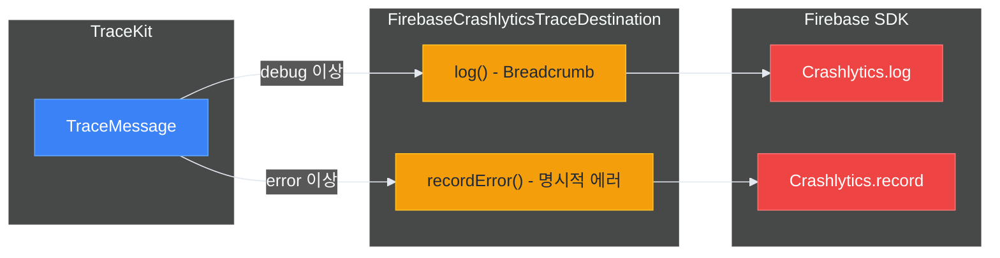

# 🔌 외부 연동

> 작성일: 2025-12-15
> 작성자: jimmy

## 개요

TraceKit는 `TraceDestination` 프로토콜을 통해 외부 모니터링/분석 서비스와 쉽게 연동할 수 있습니다. 별도 모듈이 아닌 **프로토콜 구현**으로 통합하므로 의존성이 가볍고 유연합니다.

> 💡 외부 서비스 연동 후에도 동기 API(`TraceKit.error(...)`)로 간편하게 로깅할 수 있습니다.
> 내부적으로 Fire-and-Forget 패턴으로 처리됩니다.

| 연동 서비스 | 용도 | 구현 상태 |
|---------|------|---------|
| Firebase Crashlytics | 크래시 리포팅, Breadcrumb | ✅ 데모 앱 구현 |
| Firebase Analytics | 이벤트 트래킹 | ✅ 데모 앱 구현 |
| Sentry | 에러 모니터링, 이슈 추적 | 🔧 사용자 구현 가능 |
| Datadog | 로그 분석, 메트릭 | 🔧 사용자 구현 가능 |

## TraceDestination 프로토콜

모든 외부 연동은 `TraceDestination` 프로토콜을 구현하여 이루어집니다.

```swift
public protocol TraceDestination: Actor {
    var identifier: String { get }
    var minLevel: TraceLevel { get set }
    var isEnabled: Bool { get set }
    func log(_ message: TraceMessage) async
    func flush(_ messages: [TraceMessage]) async
}
```

## Firebase Crashlytics 연동

### 개요

데모 앱(`TraceKitDemo`)에 구현된 `FirebaseCrashlyticsTraceDestination`은 TraceKit 로그를 Firebase Crashlytics로 전송하는 실제 구현 예시입니다.

### 설치

1. Firebase SDK 추가 (SPM)

```swift
// Package.swift 또는 Tuist Dependencies.swift
.package(url: "https://github.com/firebase/firebase-ios-sdk", from: "10.0.0")
```

2. `GoogleService-Info.plist` 추가

### 구현 참고

데모 앱의 구현을 참고하여 프로젝트에 복사할 수 있습니다:

```
Projects/TraceKitDemo/Sources/Infrastructure/
├── FirebaseCrashlyticsTraceDestination.swift  # Crashlytics 연동
└── FirebaseAnalyticsTraceDestination.swift    # Analytics 연동
```

### 초기화

```swift
import TraceKit
import FirebaseCore
import FirebaseCrashlytics

@main
struct MyApp: App {
    init() {
        // Firebase 초기화
        FirebaseApp.configure()
        
        Task {
            await setupTraceKit()
        }
    }
    
    @TraceKitActor
    func setupTraceKit() async {
        // 데모 앱 구현을 복사하거나 직접 구현
        let crashlyticsDestination = FirebaseCrashlyticsTraceDestination()
        
        let logger = await TraceKitBuilder()
            .addConsole()
            .addDestination(crashlyticsDestination)
            .buildAsShared()
    }
}
```

### 동작 방식



| 레벨 | Breadcrumb | recordError() |
|-----|-----------|---------------|
| verbose | ❌ | ❌ |
| debug | ✅ | ❌ |
| info | ✅ | ❌ |
| warning | ✅ | ❌ |
| error | ✅ | ✅ (Non-fatal) |
| fatal | ✅ | ✅ (Non-fatal) |

### 구현 예시

```swift
import Foundation
import TraceKit
import FirebaseCrashlytics

actor FirebaseCrashlyticsTraceDestination: TraceDestination {
    private nonisolated let crashlytics = Crashlytics.crashlytics()
    
    nonisolated var identifier: String { "firebase.crashlytics" }
    var minLevel: TraceLevel = .debug
    var isEnabled: Bool = true
    
    func log(_ message: TraceMessage) async {
        guard shouldLog(message) else { return }
        
        // Breadcrumb로 기록
        let breadcrumb = formatBreadcrumb(message)
        crashlytics.log(breadcrumb)
        
        // 에러 레벨은 명시적 에러로 기록
        if message.level >= .error {
            recordError(message)
        }
    }
    
    private func formatBreadcrumb(_ message: TraceMessage) -> String {
        "[\(message.level.name)] [\(message.category)] \(message.message)"
    }
    
    private func recordError(_ message: TraceMessage) {
        let error = NSError(
            domain: "com.myapp",
            code: message.level.rawValue,
            userInfo: [
                NSLocalizedDescriptionKey: message.message,
                "category": message.category,
                "level": message.level.name
            ]
        )
        crashlytics.record(error: error)
    }
}
```

## Firebase Analytics 연동

### 개요

TraceKit 로그를 Firebase Analytics 이벤트로 전송할 수 있습니다.

### 구현 예시

```swift
import Foundation
import TraceKit
import FirebaseAnalytics

actor FirebaseAnalyticsTraceDestination: TraceDestination {
    nonisolated var identifier: String { "firebase.analytics" }
    var minLevel: TraceLevel = .info
    var isEnabled: Bool = true
    
    func log(_ message: TraceMessage) async {
        guard shouldLog(message) else { return }
        
        // 에러 레벨만 이벤트로 전송
        guard message.level >= .error else { return }
        
        Analytics.logEvent("trace_error", parameters: [
            "level": message.level.name,
            "category": message.category,
            "message": message.message,
            "file": message.fileName,
            "line": message.line
        ])
    }
}
```

## Sentry 연동 (구현 예시)

### 설치

```swift
// Package.swift
.package(url: "https://github.com/getsentry/sentry-cocoa", from: "8.0.0")
```

### 구현 예시

```swift
import Foundation
import TraceKit
import Sentry

actor SentryTraceDestination: TraceDestination {
    private let dsn: String
    private let environment: String
    
    nonisolated var identifier: String { "sentry" }
    var minLevel: TraceLevel = .warning
    var isEnabled: Bool = true
    
    init(dsn: String, environment: String = "production") {
        self.dsn = dsn
        self.environment = environment
        
        // Sentry SDK 초기화
        SentrySDK.start { options in
            options.dsn = dsn
            options.environment = environment
        }
    }
    
    func log(_ message: TraceMessage) async {
        guard shouldLog(message) else { return }
        
        // Breadcrumb 추가
        let breadcrumb = Breadcrumb(
            level: sentryLevel(from: message.level),
            category: message.category
        )
        breadcrumb.message = message.message
        SentrySDK.addBreadcrumb(breadcrumb)
        
        // 에러는 이벤트로 전송
        if message.level >= .error {
            let event = Event(level: sentryLevel(from: message.level))
            event.message = SentryMessage(formatted: message.message)
            event.tags = ["category": message.category]
            SentrySDK.capture(event: event)
        }
    }
    
    private func sentryLevel(from level: TraceLevel) -> SentryLevel {
        switch level {
        case .verbose, .debug: return .debug
        case .info: return .info
        case .warning: return .warning
        case .error: return .error
        case .fatal: return .fatal
        }
    }
}
```

### 사용법

```swift
let sentryDestination = SentryTraceDestination(
    dsn: "https://xxx@sentry.io/123",
    environment: "production"
)

let logger = await TraceKitBuilder()
    .addConsole()
    .addDestination(sentryDestination)
    .buildAsShared()
```

## Datadog 연동 (구현 예시)

### 설치

```swift
// Package.swift
.package(url: "https://github.com/DataDog/dd-sdk-ios", from: "2.0.0")
```

### 구현 예시

```swift
import Foundation
import TraceKit
import DatadogCore
import DatadogLogs

actor DatadogTraceDestination: TraceDestination {
    private let logger: LoggerProtocol
    
    nonisolated var identifier: String { "datadog" }
    var minLevel: TraceLevel = .info
    var isEnabled: Bool = true
    
    init(clientToken: String, environment: String, serviceName: String) {
        // Datadog SDK 초기화
        Datadog.initialize(
            with: Datadog.Configuration(
                clientToken: clientToken,
                env: environment,
                service: serviceName
            ),
            trackingConsent: .granted
        )
        
        logger = Logger.create()
    }
    
    func log(_ message: TraceMessage) async {
        guard shouldLog(message) else { return }
        
        let attributes: [String: Encodable] = [
            "category": message.category,
            "file": message.fileName,
            "function": message.function,
            "line": message.line
        ]
        
        switch message.level {
        case .verbose, .debug:
            logger.debug(message.message, attributes: attributes)
        case .info:
            logger.info(message.message, attributes: attributes)
        case .warning:
            logger.warn(message.message, attributes: attributes)
        case .error:
            logger.error(message.message, attributes: attributes)
        case .fatal:
            logger.critical(message.message, attributes: attributes)
        }
    }
}
```

### 사용법

```swift
let datadogDestination = DatadogTraceDestination(
    clientToken: "pub_xxx",
    environment: "production",
    serviceName: "my-ios-app"
)

let logger = await TraceKitBuilder()
    .addConsole()
    .addDestination(datadogDestination)
    .buildAsShared()
```

## 복합 구성 예제

### 모든 서비스 연동

```swift
import TraceKit
import FirebaseCore

@TraceKitActor
func setupProductionTraceKit() async {
    // Firebase 초기화
    FirebaseApp.configure()
    
    // Firebase Crashlytics (데모 앱 구현 참조)
    let crashlyticsDestination = FirebaseCrashlyticsTraceDestination()
    
    // Sentry (사용자 구현)
    let sentryDestination = SentryTraceDestination(
        dsn: "https://xxx@sentry.io/123",
        environment: "production"
    )
    
    // Datadog (사용자 구현)
    let datadogDestination = DatadogTraceDestination(
        clientToken: "pub_xxx",
        environment: "production",
        serviceName: "my-app"
    )
    
    // TraceKit 구성
    let logger = await TraceKitBuilder()
        // 로컬 출력
        .addConsole(minLevel: .warning)
        .addOSLog(minLevel: .info)
        .addFile(minLevel: .debug)
        
        // 외부 서비스
        .addDestination(crashlyticsDestination)
        .addDestination(sentryDestination)
        .addDestination(datadogDestination)
        
        // 정책
        .withBuffer(policy: .default)
        .withSampling(policy: .production)
        .withDefaultSanitizer()
        .withDefaultContextProvider(environment: .production)
        
        .buildAsShared()
}
```

### 환경별 구성

```swift
@TraceKitActor
func setupTraceKit(environment: Environment) async {
    let builder = TraceKitBuilder()
        .addConsole(formatter: PrettyTraceFormatter.verbose)
        .withDefaultSanitizer()
    
    switch environment {
    case .debug:
        // 디버그: 콘솔만
        _ = await builder
            .with(configuration: .debug)
            .buildAsShared()
        
    case .staging:
        // 스테이징: 콘솔 + Firebase
        FirebaseApp.configure()
        let crashlytics = FirebaseCrashlyticsTraceDestination()
        _ = await builder
            .addDestination(crashlytics)
            .buildAsShared()
        
    case .production:
        // 프로덕션: 전체 구성
        FirebaseApp.configure()
        let crashlytics = FirebaseCrashlyticsTraceDestination()
        let sentry = SentryTraceDestination(
            dsn: "https://xxx@sentry.io/prod",
            environment: "production"
        )
        
        _ = await builder
            .addOSLog(minLevel: .info)
            .addFile(minLevel: .info)
            .addDestination(crashlytics)
            .addDestination(sentry)
            .withBuffer(policy: .default)
            .withSampling(policy: .production)
            .buildAsShared()
    }
}
```

## 커스텀 Destination 구현 가이드

### 기본 구조

```swift
import Foundation
import TraceKit

actor MyCustomDestination: TraceDestination {
    // 필수 프로퍼티
    nonisolated var identifier: String { "my.custom" }
    var minLevel: TraceLevel = .info
    var isEnabled: Bool = true
    
    // 초기화
    init(/* 필요한 설정 */) {
        // SDK 초기화 등
    }
    
    // 필수 메서드
    func log(_ message: TraceMessage) async {
        guard shouldLog(message) else { return }
        
        // 외부 서비스로 로그 전송
        await sendToExternalService(message)
    }
    
    // flush는 기본 구현 사용 가능 (배치 처리가 필요한 경우만 override)
    func flush(_ messages: [TraceMessage]) async {
        // 배치 전송 최적화
        for message in messages {
            await log(message)
        }
    }
    
    private func sendToExternalService(_ message: TraceMessage) async {
        // 구현
    }
}
```

### 구현 체크리스트

- [ ] `TraceDestination` 프로토콜 채택
- [ ] `identifier`를 고유한 값으로 설정
- [ ] `log(_:)` 메서드에서 `shouldLog(_:)` 확인
- [ ] Actor로 구현하여 스레드 안전성 보장
- [ ] 외부 SDK 초기화 순서 고려
- [ ] 에러 처리 및 재시도 로직 구현
- [ ] 민감정보는 이미 정제된 상태로 수신됨 (추가 처리 불필요)

## 데모 앱에서 확인하기

TraceKitDemo 앱에서 실제 구현 예시를 확인할 수 있습니다:

- **Firebase Crashlytics 연동**: `CrashlyticsRealtime` 탭
- **Firebase Analytics 연동**: `AnalyticsRealtime` 탭
- **구현 코드**: `Projects/TraceKitDemo/Sources/Infrastructure/`

자세한 내용은 [데모 앱](./07-데모-앱.md) 문서를 참고하세요.

## 문제 해결

### Firebase 로그가 보이지 않음

1. `GoogleService-Info.plist` 확인
2. `FirebaseApp.configure()` 호출 확인
3. 크래시 발생 후 앱 재실행 필요
4. 디버거 연결 시 크래시 리포트 비활성화됨

### 외부 SDK 초기화 순서

```swift
// 올바른 순서
FirebaseApp.configure()          // 1. Firebase 초기화
Datadog.initialize(...)          // 2. Datadog 초기화
SentrySDK.start { ... }          // 3. Sentry 초기화

// 그 다음 TraceKit 설정
await TraceKitBuilder()
    .addDestination(...)
    .buildAsShared()
```

### 샘플링으로 로그가 필터링됨

샘플링 정책이 활성화된 경우 일부 로그가 외부 서비스로 전송되지 않을 수 있습니다. 특정 카테고리나 레벨의 로그를 100% 전송하려면 샘플링 정책을 조정하세요.

```swift
let policy = SamplingPolicy(
    defaultRate: 0.1,
    ratesByCategory: [
        "Auth": 1.0,      // Auth 카테고리는 100% 전송
        "Payment": 1.0    // Payment 카테고리는 100% 전송
    ],
    alwaysIncludeLevels: [.error, .fatal]
)
```

## 다음 단계

- [런타임 설정](./06-런타임-설정.md) - Launch Arguments로 동적 제어
- [데모 앱](./07-데모-앱.md) - Firebase 연동 실제 구현 확인
