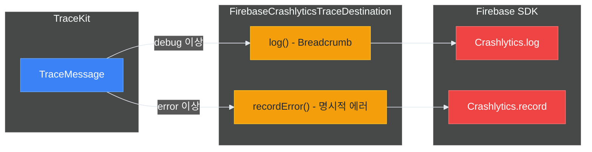

# 🔌 외부 연동

> 작성일: 2025-12-15
> 작성자: jimmy

## 개요

TraceKit는 `TraceDestination` 프로토콜을 통해 외부 모니터링/분석 서비스와 쉽게 연동할 수 있습니다. 별도 모듈이 아닌 **프로토콜 구현**으로 통합하므로 의존성이 가볍고 유연합니다.

> 💡 외부 서비스 연동 후에도 동기 API(`TraceKit.error(...)`)로 간편하게 로깅할 수 있습니다.
> 내부적으로 Fire-and-Forget 패턴으로 처리됩니다.

| 연동 서비스 | 용도 | 구현 상태 |
|---------|------|---------|
| Firebase Crashlytics | 크래시 리포팅, Breadcrumb | ✅ 데모 앱 구현 |
| Firebase Analytics | 이벤트 트래킹 | ✅ 데모 앱 구현 |
| Sentry | 에러 모니터링, 이슈 추적 | 🔧 사용자 구현 가능 |
| Datadog | 로그 분석, 메트릭 | 🔧 사용자 구현 가능 |

## TraceDestination 프로토콜

모든 외부 연동은 `TraceDestination` 프로토콜을 구현하여 이루어집니다.

```swift
public protocol TraceDestination: Actor {
    var identifier: String { get }
    var minLevel: TraceLevel { get set }
    var isEnabled: Bool { get set }
    func log(_ message: TraceMessage) async
    func flush(_ messages: [TraceMessage]) async
}
```

## Firebase Crashlytics 연동

### 개요

데모 앱(`TraceKitDemo`)에 구현된 `FirebaseCrashlyticsTraceDestination`은 TraceKit 로그를 Firebase Crashlytics로 전송하는 실제 구현 예시입니다.

### 설치

1. Firebase SDK 추가 (SPM)

```swift
// Package.swift 또는 Tuist Dependencies.swift
.package(url: "https://github.com/firebase/firebase-ios-sdk", from: "10.0.0")
```

2. `GoogleService-Info.plist` 추가

### 구현 참고

데모 앱의 구현을 참고하여 프로젝트에 복사할 수 있습니다:

```
Projects/TraceKitDemo/Sources/Infrastructure/
├── FirebaseCrashlyticsTraceDestination.swift  # Crashlytics 연동
└── FirebaseAnalyticsTraceDestination.swift    # Analytics 연동
```

### 초기화

```swift
import TraceKit
import FirebaseCore
import FirebaseCrashlytics

@main
struct MyApp: App {
    init() {
        // Firebase 초기화
        FirebaseApp.configure()
        
        Task {
            await setupTraceKit()
        }
    }
    
    @TraceKitActor
    func setupTraceKit() async {
        // 데모 앱 구현을 복사하거나 직접 구현
        let crashlyticsDestination = FirebaseCrashlyticsTraceDestination()
        
        let logger = await TraceKitBuilder()
            .addConsole()
            .addDestination(crashlyticsDestination)
            .buildAsShared()
    }
}
```

### 동작 방식



| 레벨 | Breadcrumb | recordError() |
|-----|-----------|---------------|
| verbose | ❌ | ❌ |
| debug | ✅ | ❌ |
| info | ✅ | ❌ |
| warning | ✅ | ❌ |
| error | ✅ | ✅ (Non-fatal) |
| fatal | ✅ | ✅ (Non-fatal) |

### 구현 예시

```swift
import Foundation
import TraceKit
import FirebaseCrashlytics

actor FirebaseCrashlyticsTraceDestination: TraceDestination {
    private nonisolated let crashlytics = Crashlytics.crashlytics()
    
    nonisolated var identifier: String { "firebase.crashlytics" }
    var minLevel: TraceLevel = .debug
    var isEnabled: Bool = true
    
    func log(_ message: TraceMessage) async {
        guard shouldLog(message) else { return }
        
        // Breadcrumb로 기록
        let breadcrumb = formatBreadcrumb(message)
        crashlytics.log(breadcrumb)
        
        // 에러 레벨은 명시적 에러로 기록
        if message.level >= .error {
            recordError(message)
        }
    }
    
    private func formatBreadcrumb(_ message: TraceMessage) -> String {
        "[\(message.level.name)] [\(message.category)] \(message.message)"
    }
    
    private func recordError(_ message: TraceMessage) {
        let error = NSError(
            domain: "com.myapp",
            code: message.level.rawValue,
            userInfo: [
                NSLocalizedDescriptionKey: message.message,
                "category": message.category,
                "level": message.level.name
            ]
        )
        crashlytics.record(error: error)
    }
}
```

## Firebase Analytics 연동

### 개요

TraceKit 로그를 Firebase Analytics 이벤트로 전송할 수 있습니다.

### 구현 예시

```swift
import Foundation
import TraceKit
import FirebaseAnalytics

actor FirebaseAnalyticsTraceDestination: TraceDestination {
    nonisolated var identifier: String { "firebase.analytics" }
    var minLevel: TraceLevel = .info
    var isEnabled: Bool = true
    
    func log(_ message: TraceMessage) async {
        guard shouldLog(message) else { return }
        
        // 에러 레벨만 이벤트로 전송
        guard message.level >= .error else { return }
        
        Analytics.logEvent("trace_error", parameters: [
            "level": message.level.name,
            "category": message.category,
            "message": message.message,
            "file": message.fileName,
            "line": message.line
        ])
    }
}
```

## Sentry 연동 (구현 예시)

### 설치

```swift
// Package.swift
.package(url: "https://github.com/getsentry/sentry-cocoa", from: "8.0.0")
```

### 구현 예시

```swift
import Foundation
import TraceKit
import Sentry

actor SentryTraceDestination: TraceDestination {
    private let dsn: String
    private let environment: String
    
    nonisolated var identifier: String { "sentry" }
    var minLevel: TraceLevel = .warning
    var isEnabled: Bool = true
    
    init(dsn: String, environment: String = "production") {
        self.dsn = dsn
        self.environment = environment
        
        // Sentry SDK 초기화
        SentrySDK.start { options in
            options.dsn = dsn
            options.environment = environment
        }
    }
    
    func log(_ message: TraceMessage) async {
        guard shouldLog(message) else { return }
        
        // Breadcrumb 추가
        let breadcrumb = Breadcrumb(
            level: sentryLevel(from: message.level),
            category: message.category
        )
        breadcrumb.message = message.message
        SentrySDK.addBreadcrumb(breadcrumb)
        
        // 에러는 이벤트로 전송
        if message.level >= .error {
            let event = Event(level: sentryLevel(from: message.level))
            event.message = SentryMessage(formatted: message.message)
            event.tags = ["category": message.category]
            SentrySDK.capture(event: event)
        }
    }
    
    private func sentryLevel(from level: TraceLevel) -> SentryLevel {
        switch level {
        case .verbose, .debug: return .debug
        case .info: return .info
        case .warning: return .warning
        case .error: return .error
        case .fatal: return .fatal
        }
    }
}
```

### 사용법

```swift
let sentryDestination = SentryTraceDestination(
    dsn: "https://xxx@sentry.io/123",
    environment: "production"
)

let logger = await TraceKitBuilder()
    .addConsole()
    .addDestination(sentryDestination)
    .buildAsShared()
```

## Datadog 연동 (구현 예시)

### 설치

```swift
// Package.swift
.package(url: "https://github.com/DataDog/dd-sdk-ios", from: "2.0.0")
```

### 구현 예시

```swift
import Foundation
import TraceKit
import DatadogCore
import DatadogLogs

actor DatadogTraceDestination: TraceDestination {
    private let logger: LoggerProtocol
    
    nonisolated var identifier: String { "datadog" }
    var minLevel: TraceLevel = .info
    var isEnabled: Bool = true
    
    init(clientToken: String, environment: String, serviceName: String) {
        // Datadog SDK 초기화
        Datadog.initialize(
            with: Datadog.Configuration(
                clientToken: clientToken,
                env: environment,
                service: serviceName
            ),
            trackingConsent: .granted
        )
        
        logger = Logger.create()
    }
    
    func log(_ message: TraceMessage) async {
        guard shouldLog(message) else { return }
        
        let attributes: [String: Encodable] = [
            "category": message.category,
            "file": message.fileName,
            "function": message.function,
            "line": message.line
        ]
        
        switch message.level {
        case .verbose, .debug:
            logger.debug(message.message, attributes: attributes)
        case .info:
            logger.info(message.message, attributes: attributes)
        case .warning:
            logger.warn(message.message, attributes: attributes)
        case .error:
            logger.error(message.message, attributes: attributes)
        case .fatal:
            logger.critical(message.message, attributes: attributes)
        }
    }
}
```

### 사용법

```swift
let datadogDestination = DatadogTraceDestination(
    clientToken: "pub_xxx",
    environment: "production",
    serviceName: "my-ios-app"
)

let logger = await TraceKitBuilder()
    .addConsole()
    .addDestination(datadogDestination)
    .buildAsShared()
```

## 복합 구성 예제

### 모든 서비스 연동

```swift
import TraceKit
import FirebaseCore

@TraceKitActor
func setupProductionTraceKit() async {
    // Firebase 초기화
    FirebaseApp.configure()
    
    // Firebase Crashlytics (데모 앱 구현 참조)
    let crashlyticsDestination = FirebaseCrashlyticsTraceDestination()
    
    // Sentry (사용자 구현)
    let sentryDestination = SentryTraceDestination(
        dsn: "https://xxx@sentry.io/123",
        environment: "production"
    )
    
    // Datadog (사용자 구현)
    let datadogDestination = DatadogTraceDestination(
        clientToken: "pub_xxx",
        environment: "production",
        serviceName: "my-app"
    )
    
    // TraceKit 구성
    let logger = await TraceKitBuilder()
        // 로컬 출력
        .addConsole(minLevel: .warning)
        .addOSLog(minLevel: .info)
        .addFile(minLevel: .debug)
        
        // 외부 서비스
        .addDestination(crashlyticsDestination)
        .addDestination(sentryDestination)
        .addDestination(datadogDestination)
        
        // 정책
        .withBuffer(policy: .default)
        .withSampling(policy: .production)
        .withDefaultSanitizer()
        .withDefaultContextProvider(environment: .production)
        
        .buildAsShared()
}
```

### 환경별 구성

```swift
@TraceKitActor
func setupTraceKit(environment: Environment) async {
    let builder = TraceKitBuilder()
        .addConsole(formatter: PrettyTraceFormatter.verbose)
        .withDefaultSanitizer()
    
    switch environment {
    case .debug:
        // 디버그: 콘솔만
        _ = await builder
            .with(configuration: .debug)
            .buildAsShared()
        
    case .staging:
        // 스테이징: 콘솔 + Firebase
        FirebaseApp.configure()
        let crashlytics = FirebaseCrashlyticsTraceDestination()
        _ = await builder
            .addDestination(crashlytics)
            .buildAsShared()
        
    case .production:
        // 프로덕션: 전체 구성
        FirebaseApp.configure()
        let crashlytics = FirebaseCrashlyticsTraceDestination()
        let sentry = SentryTraceDestination(
            dsn: "https://xxx@sentry.io/prod",
            environment: "production"
        )
        
        _ = await builder
            .addOSLog(minLevel: .info)
            .addFile(minLevel: .info)
            .addDestination(crashlytics)
            .addDestination(sentry)
            .withBuffer(policy: .default)
            .withSampling(policy: .production)
            .buildAsShared()
    }
}
```

## 커스텀 Destination 구현 가이드

### 기본 구조

```swift
import Foundation
import TraceKit

actor MyCustomDestination: TraceDestination {
    // 필수 프로퍼티
    nonisolated var identifier: String { "my.custom" }
    var minLevel: TraceLevel = .info
    var isEnabled: Bool = true
    
    // 초기화
    init(/* 필요한 설정 */) {
        // SDK 초기화 등
    }
    
    // 필수 메서드
    func log(_ message: TraceMessage) async {
        guard shouldLog(message) else { return }
        
        // 외부 서비스로 로그 전송
        await sendToExternalService(message)
    }
    
    // flush는 기본 구현 사용 가능 (배치 처리가 필요한 경우만 override)
    func flush(_ messages: [TraceMessage]) async {
        // 배치 전송 최적화
        for message in messages {
            await log(message)
        }
    }
    
    private func sendToExternalService(_ message: TraceMessage) async {
        // 구현
    }
}
```

### 구현 체크리스트

- [ ] `TraceDestination` 프로토콜 채택
- [ ] `identifier`를 고유한 값으로 설정
- [ ] `log(_:)` 메서드에서 `shouldLog(_:)` 확인
- [ ] Actor로 구현하여 스레드 안전성 보장
- [ ] 외부 SDK 초기화 순서 고려
- [ ] 에러 처리 및 재시도 로직 구현
- [ ] 민감정보는 이미 정제된 상태로 수신됨 (추가 처리 불필요)

## 데모 앱에서 확인하기

TraceKitDemo 앱에서 실제 구현 예시를 확인할 수 있습니다:

- **Firebase Crashlytics 연동**: `CrashlyticsRealtime` 탭
- **Firebase Analytics 연동**: `AnalyticsRealtime` 탭
- **구현 코드**: `Projects/TraceKitDemo/Sources/Infrastructure/`

자세한 내용은 [데모 앱](./07-데모-앱.md) 문서를 참고하세요.

## 문제 해결

### Firebase 로그가 보이지 않음

1. `GoogleService-Info.plist` 확인
2. `FirebaseApp.configure()` 호출 확인
3. 크래시 발생 후 앱 재실행 필요
4. 디버거 연결 시 크래시 리포트 비활성화됨

### 외부 SDK 초기화 순서

```swift
// 올바른 순서
FirebaseApp.configure()          // 1. Firebase 초기화
Datadog.initialize(...)          // 2. Datadog 초기화
SentrySDK.start { ... }          // 3. Sentry 초기화

// 그 다음 TraceKit 설정
await TraceKitBuilder()
    .addDestination(...)
    .buildAsShared()
```

### 샘플링으로 로그가 필터링됨

샘플링 정책이 활성화된 경우 일부 로그가 외부 서비스로 전송되지 않을 수 있습니다. 특정 카테고리나 레벨의 로그를 100% 전송하려면 샘플링 정책을 조정하세요.

```swift
let policy = SamplingPolicy(
    defaultRate: 0.1,
    ratesByCategory: [
        "Auth": 1.0,      // Auth 카테고리는 100% 전송
        "Payment": 1.0    // Payment 카테고리는 100% 전송
    ],
    alwaysIncludeLevels: [.error, .fatal]
)
```

---

## Firebase 통합 모듈

TraceKit과 Firebase의 4대 핵심 서비스를 연동하는 통합 모듈입니다.

### 개요

TraceKit의 로깅과 성능 추적 기능을 Firebase의 4대 서비스에 자동으로 연동합니다.

| 모듈 | Firebase 서비스 | 주요 기능 | Console 위치 |
|------|----------------|-----------|-------------|
| FirebaseAnalyticsTraceDestination | Analytics | 에러 패턴 분석, 사용자 행동 추적 | Analytics > Events |
| FirebaseCrashlyticsTraceDestination | Crashlytics | 실시간 크래시 추적, Breadcrumb | Crashlytics > Dashboard |
| FirebasePerformanceTraceExtension | Performance | 커스텀 성능 추적, 병목 지점 탐지 | Performance > Custom traces |
| FirebaseRemoteConfigManager | Remote Config | 원격 설정, A/B 테스트, 긴급 설정 변경 | Remote Config > Parameters |

### 1. FirebaseAnalyticsTraceDestination

**목적**: TraceKit 로그를 Firebase Analytics 이벤트로 전송하여 에러 패턴 분석 및 BigQuery 연동

#### 전송 정책

```
레벨별 처리:
- .error    → trace_error 이벤트 전송
- .fatal    → trace_fatal 이벤트 전송
- 그 외     → 전송 안함 (과도한 이벤트 방지)
```

#### 설정 방법

```swift
// TraceKit 초기화 시 추가
let analyticsDestination = FirebaseAnalyticsTraceDestination()
await TraceKitBuilder()
    .addDestination(analyticsDestination)
    .buildAsShared()
```

#### Analytics 이벤트 구조

전송되는 이벤트 파라미터:

```swift
{
    "level": "error",                    // 로그 레벨
    "category": "Network",               // 로그 카테고리
    "message": "API request failed...",  // 메시지 (최대 100자)
    "timestamp": "2026-01-22T14:15:00Z"  // ISO8601 타임스탬프
}
```

#### User Properties 자동 동기화

TraceKit의 UserContext가 Firebase Analytics User Properties로 자동 동기화됩니다.

```swift
// UserContextProvider를 통해 사용자 정보 설정
let contextProvider = DefaultUserContextProvider()
await contextProvider.setUserId("user_12345")
await contextProvider.setCustomAttribute("plan", value: "premium")

// TraceKit에 provider 설정
await TraceKit.async.setContextProvider(contextProvider)

// 이후 로그 메시지에 자동으로 UserContext가 첨부되고
// → Firebase Analytics에 자동 동기화
// User ID: user_12345
// User Property: plan = premium
```

#### Firebase Console 확인

**실시간 데이터 (즉시 확인)**
```
Firebase Console > Analytics > Realtime
- trace_error, trace_fatal 이벤트가 실시간으로 표시됨
```

**이벤트 분석 (24시간 후)**
```
Firebase Console > Analytics > Events
- trace_error, trace_fatal 클릭
- 에러 발생 빈도, 영향받은 사용자 수, 디바이스별 통계 확인
```

#### 제약사항

- 메시지 최대 길이: 100자 (초과 시 자동 절단)
- User Property 이름: 24자 이내, 알파벳으로 시작
- 무료 플랜: 하루 500개 이벤트 제한

### 2. FirebaseCrashlyticsTraceDestination (상세)

**목적**: TraceKit 로그를 Crashlytics Breadcrumb로 기록하여 크래시 발생 시 문맥 파악

#### 전송 정책

```
레벨별 처리:
- .debug, .info, .warning  → Breadcrumb 형식으로 기록
- .error, .fatal           → NSError로 명시적 기록 + Breadcrumb
```

#### Breadcrumb 형식

```
[ERROR] [Network] API request failed: timeout after 30s
[WARNING] [Auth] Token expires in 5 minutes
[INFO] [App] User logged in successfully
```

#### 명시적 에러 기록

.error, .fatal 레벨은 NSError로 변환되어 Crashlytics에 명시적으로 기록됩니다.

```swift
NSError {
    domain: "com.tracekit.TraceKitDemo"
    code: 1000 (error) 또는 2000 (fatal)
    userInfo: {
        "NSLocalizedDescription": "메시지 내용",
        "category": "Network",
        "level": "error",
        "timestamp": "2026-01-22T14:15:00Z"
    }
}
```

#### User Context 자동 동기화

```swift
// UserContextProvider를 통해 사용자 정보 설정
let contextProvider = DefaultUserContextProvider()
await contextProvider.setUserId("user_12345")
await contextProvider.setCustomAttribute("version", value: "1.2.0")

await TraceKit.async.setContextProvider(contextProvider)

// → Crashlytics에 자동 동기화
// Crashlytics User ID: user_12345
// Custom Key: version = 1.2.0
```

#### 활용 시나리오

1. 크래시 재현 경로 파악
2. 특정 사용자에게만 발생하는 이슈 분석
3. 크래시 직전 사용자 행동 패턴 분석

### 3. FirebasePerformanceTraceExtension

**목적**: TraceKit의 TraceSpan을 Firebase Performance Monitoring과 연동하여 성능 병목 지점 탐지

#### 사용 방법 1: TraceSpan 직접 전송

```swift
// 1. TraceKit span 생성 및 작업 수행
let spanId = await TraceKit.async.startSpan(name: "fetchUserProfile")

// 2. 비즈니스 로직 실행
let profile = try await apiClient.fetchUserProfile()

// 3. Span 종료 및 Firebase Performance 전송
if let completedSpan = await TraceKit.async.tracer.endSpan(id: spanId) {
    await completedSpan.sendToFirebasePerformance()
}
```

#### 사용 방법 2: FirebasePerformanceHelper 활용

```swift
// 성능 추적과 함께 작업 실행 (TraceKit + Firebase 동시 기록)
let result = try await FirebasePerformanceHelper.trace(name: "processPayment") {
    return try await paymentService.process(order)
}

// 자동으로 TraceKit과 Firebase Performance에 모두 기록됨
```

**장애 대응**
- Firebase Performance trace 생성 실패 시에도 TraceKit span은 정상 작동
- 네트워크 오류나 Firebase 서비스 장애에 영향받지 않음
- 앱 핵심 기능은 보호되며 성능 추적만 실패

#### 전송되는 메트릭

Firebase Performance에 전송되는 성능 데이터:

```swift
Trace {
    name: "fetchUserProfile"
    metrics: {
        "duration_ms": 1234,           // 실행 시간 (밀리초)
        "memory_bytes": 2048000,       // 메모리 사용량 (있는 경우)
        // ... 기타 TraceSpan의 숫자형 metadata
    }
    attributes: {
        "user_id": "user_12345",       // 사용자 ID
        "device_type": "iPhone14",     // 기타 문자열 metadata (최대 100자)
    }
}
```

#### Trace 이름 규칙

Firebase Performance는 엄격한 네이밍 규칙이 있습니다:

```
규칙:
- 최대 100자
- 알파벳으로 시작
- 알파벳, 숫자, 언더스코어만 허용

변환 예시:
"Fetch User Profile" → "Fetch_User_Profile"
"123-test"           → "trace_123_test"
```

#### Firebase Console 확인

```
Firebase Console > Performance > Custom traces
- 커스텀 trace 이름으로 검색 (예: fetchUserProfile)
- Duration, Success rate, Affected users 확인
- 디바이스별, OS 버전별 성능 비교
```

#### 활용 시나리오

1. API 응답 시간 모니터링
2. 무거운 계산 작업 성능 추적
3. 이미지 로딩 시간 측정
4. 데이터베이스 쿼리 성능 분석

### 4. FirebaseRemoteConfigManager

**목적**: 앱 업데이트 없이 TraceKit의 동작을 원격으로 제어

#### Remote Config 키

Firebase Console에서 설정 가능한 키:

| 키 | 타입 | 기본값 | 설명 |
|----|------|--------|------|
| `tracekit_min_level` | String | "info" | 최소 로그 레벨 (verbose, debug, info, warning, error, fatal) |
| `tracekit_sampling_rate` | Number | 1.0 | 샘플링 비율 (0.0 ~ 1.0) |
| `tracekit_enable_crashlytics` | Boolean | true | Crashlytics 연동 활성화 |
| `tracekit_enable_analytics` | Boolean | true | Analytics 연동 활성화 |
| `tracekit_enable_performance` | Boolean | true | Performance 연동 활성화 |
| `tracekit_enable_sanitizer` | Boolean | true | 민감정보 마스킹 활성화 |

#### 초기 설정

```swift
// 1. FirebaseRemoteConfigManager 생성
let remoteConfigManager = FirebaseRemoteConfigManager()

// 2. Remote Config 값 가져오기 (1시간 캐시 고려)
await remoteConfigManager.fetchAndActivate()

// 3. TraceKit에 실시간 적용
await remoteConfigManager.applyToTraceKit()
```

#### 실시간 자동 업데이트 (권장)

Firebase Console에서 설정을 변경하면 앱이 자동으로 알림을 받아 즉시 반영합니다.

```swift
// 실시간 업데이트 리스너 시작
await remoteConfigManager.startRealtimeUpdates()

// Firebase Console에서 tracekit_min_level을 변경하면
// → 앱이 자동으로 알림 받음
// → activate() 및 applyToTraceKit() 자동 실행
// → TraceKit이 즉시 새 설정으로 동작
```

**동작 방식**:
```
1. Firebase Console에서 설정 변경 (예: tracekit_min_level = "verbose")
2. Firebase가 연결된 모든 앱에 푸시 알림 전송 (2-3초 이내)
3. 앱의 addOnConfigUpdateListener가 알림 수신
4. 자동으로 activate() 실행
5. 자동으로 applyToTraceKit() 호출
6. TraceKit이 즉시 verbose 모드로 전환
7. 사용자 액션 불필요!
```

**주의사항**:
- 앱이 포그라운드(실행 중)일 때만 동작
- 백그라운드나 종료 상태에서는 다음 실행 시 fetchAndActivate()로 동기화

#### UI에서 즉시 새로고침 (캐시 무시)

RemoteConfigControl 화면에서 "새로고침" 버튼을 누르면 캐시를 무시하고 즉시 서버에서 최신 설정을 가져옵니다.

```swift
// 캐시 무시하고 즉시 가져오기
let success = await remoteConfigManager.fetchAndActivateImmediately()

if success {
    // TraceKit에 즉시 적용
    await remoteConfigManager.applyToTraceKit()
}
```

**실시간 업데이트 vs 수동 새로고침**:
| 방식 | 동작 | 사용 시점 | 사용자 액션 |
|-----|------|---------|----------|
| 실시간 업데이트 | Console 변경 시 자동 반영 | 일반적인 경우 (권장) | 불필요 |
| 수동 새로고침 | 버튼 클릭 시 즉시 가져오기 | 즉시 확인 필요 시 | 버튼 클릭 |

#### 런타임 설정 업데이트 지원

- `applyToTraceKit()` 메서드가 TraceKit의 `configure()` API를 호출하여 런타임 설정 업데이트
- 로그 레벨, 샘플링 비율, 민감정보 마스킹 등을 앱 재시작 없이 동적 변경 가능
- 버퍼와 샘플러도 새 설정으로 자동 재구성
- 설정 변경 시 TraceKit이 자동으로 변경 이력을 로깅

**런타임 업데이트 동작**
```swift
// Remote Config 값 변경 시:
// 1. minLevel: .info → .debug 변경
// 2. samplingRate: 1.0 → 0.5 변경
// 3. sanitizer: true → false 변경
// → TraceKit이 즉시 새 설정으로 동작
// → 설정 변경 로그가 자동으로 기록됨
```

#### 설정 값 확인

```swift
// 현재 적용된 설정 확인
let minLevel = await remoteConfigManager.minimumTraceLevel
let samplingRate = await remoteConfigManager.samplingRate
let isCrashlyticsEnabled = await remoteConfigManager.isCrashlyticsEnabled

print("최소 로그 레벨: \(minLevel.name)")
print("샘플링 비율: \(samplingRate)")
```

#### Firebase Console 설정

**Remote Config 파라미터 생성**
```
Firebase Console > Remote Config > Add parameter
- 파라미터 키: tracekit_min_level
- 기본값: "info"
- 조건부 값 (선택사항):
  - 조건: iOS 버전 >= 17
  - 값: "debug"
```

**변경사항 배포**
```
1. 파라미터 수정
2. 우측 상단 "Publish changes" 클릭
3. 실시간 업데이트가 활성화된 앱에 2-3초 이내 자동 반영
   (또는 주기적 갱신 사용 시 최대 1시간 이내)
```

#### 활용 시나리오

**1. 긴급 디버깅 모드 활성화 (실시간 자동)**

```
프로덕션 앱에서 특정 사용자에게 버그 발생
→ Firebase Console에서 tracekit_min_level = "verbose" 변경
→ "Publish changes" 클릭
→ 2-3초 이내 실행 중인 모든 앱에 자동 반영
→ TraceKit이 즉시 verbose 레벨로 전환 (사용자 액션 불필요)
→ 상세 로그 수집 시작
→ 버그 원인 파악 후 다시 "info"로 복원
```

**실시간 자동 반영 흐름**:
```
1. Console에서 변경: tracekit_min_level = "verbose"
2. Publish changes 클릭
3. Firebase가 앱에 푸시 알림 (2-3초)
4. 앱의 실시간 리스너가 감지
5. 자동으로 activate() + applyToTraceKit()
6. TraceKit이 즉시 verbose 모드로 전환
7. 콘솔 로그에 "🔔 [Remote Config] 설정 변경 감지" 출력
```

**2. A/B 테스트**

```
조건 A (50% 사용자): tracekit_sampling_rate = 1.0
조건 B (50% 사용자): tracekit_sampling_rate = 0.5

→ 성능/비용 영향 분석 후 최적값 결정
→ 앱 재시작 없이 실시간으로 샘플링 비율 변경
```

**3. 단계적 기능 배포**

```
초기: tracekit_enable_performance = false (10% 사용자)
1주 후: true (50% 사용자)
2주 후: true (100% 사용자)

→ Performance 데이터 수집 영향 모니터링
→ 주기적 갱신을 통해 자동으로 설정 적용
```

**4. 실시간 모니터링 강화**

```
서버 장애 감지 시:
→ Remote Config에서 tracekit_min_level = "debug" 변경
→ 모든 사용자의 앱이 1시간 이내 자동으로 상세 로깅 시작
→ Firebase Analytics/Crashlytics에 더 많은 컨텍스트 수집
→ 장애 해결 후 "info"로 복원하여 로그 볼륨 감소
```

### 통합 사용 시나리오

#### 시나리오 1: 완전한 TraceKit + Firebase 통합

```swift
import TraceKit
import FirebaseCore
import FirebaseAnalytics
import FirebaseCrashlytics
import FirebaseRemoteConfig
import FirebasePerformance

@main
struct MyApp: App {
    init() {
        Task {
            await setupTraceKitWithFirebase()
        }
    }
    
    var body: some Scene {
        WindowGroup {
            ContentView()
        }
    }
}

func setupTraceKitWithFirebase() async {
    // 1. Firebase 초기화
    FirebaseApp.configure()
    
    // 2. Remote Config 설정 가져오기
    let remoteConfigManager = FirebaseRemoteConfigManager()
    await remoteConfigManager.fetchAndActivate()
    
    let minLevel = await remoteConfigManager.minimumTraceLevel
    let samplingRate = await remoteConfigManager.samplingRate
    let isSanitizerEnabled = await remoteConfigManager.isSanitizerEnabled
    
    // 3. Firebase Destination 생성
    var analyticsDestination = FirebaseAnalyticsTraceDestination()
    var crashlyticsDestination = FirebaseCrashlyticsTraceDestination()
    
    // Remote Config에 따라 minLevel 조정 (선택사항)
    analyticsDestination.minLevel = minLevel
    crashlyticsDestination.minLevel = minLevel
    
    // 4. TraceKit Configuration 생성
    let config = TraceKitConfiguration(
        minLevel: minLevel,
        isSanitizingEnabled: isSanitizerEnabled,
        sampleRate: samplingRate,
        bufferSize: 1000
    )
    
    // 5. TraceKit 초기화
    await TraceKitBuilder()
        .addDestination(analyticsDestination)
        .addDestination(crashlyticsDestination)
        .configuration(config)
        .buildAsShared()
    
    // 6. UserContextProvider 설정 (선택사항)
    let contextProvider = DefaultUserContextProvider()
    await TraceKit.async.setContextProvider(contextProvider)
    
    // 7. 실시간 Remote Config 자동 업데이트 활성화 (권장)
    await remoteConfigManager.startRealtimeUpdates()
    // → Firebase Console에서 설정 변경 시 자동으로 TraceKit에 적용
    // → 사용자 액션 불필요, 2-3초 이내 반영
}
```

**실시간 자동 업데이트 동작 확인**:
```
1. 앱 실행
2. Firebase Console > Remote Config > tracekit_min_level = "verbose"
3. "Publish changes" 클릭
4. 2-3초 후 앱 콘솔에 자동으로 출력:
   🔔 [Remote Config] 설정 변경 감지 - 업데이트된 키: ["tracekit_min_level"]
   ✅ [Remote Config] 변경된 설정 활성화 완료
   ✅ [Remote Config] TraceKit 설정 적용 완료
   ℹ️ INFO [Configuration] TraceKit 설정 업데이트 완료
      old_min_level: INFO
      new_min_level: VERBOSE
5. 즉시 verbose 로그 출력 시작
```

#### 시나리오 2: 네트워크 요청 전체 추적

```swift
func fetchUserData() async throws -> User {
    // TraceKit 로그 + Firebase Performance 동시 추적
    return try await FirebasePerformanceHelper.trace(name: "fetchUserData") {
        // 1. 네트워크 요청 시작 로그
        await TraceKit.async.info("Starting API request", category: "Network")
        
        // 2. 실제 요청
        let response = try await apiClient.get("/user")
        
        // 3. 성공 로그
        await TraceKit.async.info("API request succeeded", category: "Network")
        
        return response
    }
}

// 결과:
// - TraceKit 로그 → Crashlytics Breadcrumb에 기록
// - TraceKit 로그 → Analytics 이벤트 (error/fatal만)
// - TraceSpan → Firebase Performance Custom Trace에 duration 기록
```

#### 시나리오 3: 에러 추적 및 분석

```swift
func processPayment(order: Order) async throws {
    do {
        // 1. 성능 추적 시작
        let spanId = await TraceKit.async.startSpan(name: "processPayment")
        
        // 2. 결제 처리
        try await paymentGateway.charge(order.total)
        
        // 3. 성공 로그
        await TraceKit.async.info("Payment processed successfully", category: "Payment")
        
        // 4. Performance 데이터 전송
        if let span = await TraceKit.async.tracer.endSpan(id: spanId) {
            await span.sendToFirebasePerformance()
        }
        
    } catch {
        // 5. 에러 로그 (자동으로 3곳에 전송)
        await TraceKit.async.error(
            "Payment failed: \(error.localizedDescription)",
            category: "Payment"
        )
        // → Analytics: trace_error 이벤트
        // → Crashlytics: NSError 기록 + Breadcrumb
        // → Console 로그
        
        throw error
    }
}
```

### Firebase Console 확인 방법

#### 1. Analytics 데이터 확인

**실시간 데이터 (즉시)**
```
Firebase Console > Analytics > Realtime
→ 현재 활성 사용자와 trace_error/trace_fatal 이벤트 실시간 확인
```

**이벤트 통계 (24시간 후)**
```
Firebase Console > Analytics > Events
→ trace_error 또는 trace_fatal 클릭
→ 발생 횟수, 영향받은 사용자, 디바이스별 분포 확인
```

**BigQuery 연동 (무료 플랜에서는 불가)**
```
Firebase Console > Project settings > Integrations > BigQuery
→ Analytics 데이터를 BigQuery로 내보내기
→ SQL로 복잡한 분석 가능
```

#### 2. Crashlytics 데이터 확인

**Non-fatal 에러 확인**
```
Firebase Console > Crashlytics > Dashboard
→ Non-fatal 탭 클릭
→ TraceKit에서 기록한 error/fatal 레벨 로그 확인
```

**Breadcrumb 확인**
```
Crashlytics > Issue 클릭 > Keys 탭
→ 크래시 발생 직전 TraceKit 로그를 시간순으로 확인
```

**사용자별 이슈 추적**
```
Crashlytics > Issue 클릭 > Users 탭
→ 어떤 사용자(UserID)에게 에러가 발생했는지 확인
```

#### 3. Performance 데이터 확인

**Custom Traces**
```
Firebase Console > Performance > Custom traces
→ TraceKit에서 전송한 trace 이름 검색
→ Duration, Success rate, 디바이스별 성능 비교
```

**세부 분석**
```
Custom trace 클릭 > Metrics 탭
→ duration_ms, memory_bytes 등 커스텀 메트릭 확인
→ 시간대별, OS 버전별 성능 트렌드 분석
```

#### 4. Remote Config 설정

**파라미터 생성**
```
Firebase Console > Remote Config > Add parameter
→ 키: tracekit_min_level
→ 기본값: "info"
→ 조건부 값 추가 (선택사항)
```

**변경사항 배포**
```
파라미터 수정 > Publish changes 클릭
→ 1시간 이내 앱에 자동 반영
```

**조건부 타겟팅**
```
Add value for condition
→ iOS 버전, 국가, 언어, 앱 버전 등으로 세분화
→ 특정 사용자 그룹에만 다른 설정 적용
```

### Firebase 문제 해결

#### Q1. Firebase Console에 데이터가 보이지 않습니다

**Analytics 데이터**
- Realtime 탭에서 몇 초 내 확인 가능
- Events 전체 통계는 최대 24시간 소요
- 디버그 모드 활성화: `FirebaseAnalyticsDebugEnabled` 플래그 추가

**Performance 데이터**
- 첫 데이터 표시까지 몇 분 ~ 1시간 소요
- 데이터가 충분히 쌓여야 통계 표시됨

**Crashlytics 데이터**
- 앱을 백그라운드로 보낸 후 30초 이내 전송
- 디버그 모드: `FirebaseCrashlyticsCollectionEnabled` 확인

#### Q2. 메시지가 잘립니다

Firebase Analytics는 파라미터 값 길이 제한이 있습니다.

```swift
// 해결 방법: 메시지를 줄이거나 중요한 부분만 추출
let shortMessage = fullMessage.prefix(97) + "..."
```

#### Q3. Remote Config 변경이 반영되지 않습니다

```swift
// 강제 업데이트 (디버깅용)
let settings = RemoteConfigSettings()
settings.minimumFetchInterval = 0  // 제한 없음 (프로덕션에서는 사용 금지)
remoteConfig.configSettings = settings
```

#### Q4. Firebase Performance trace가 생성되지 않습니다

Trace 이름이 Firebase 규칙을 위반했을 가능성:

```swift
// 잘못된 이름
"User Profile - Fetch"  // 공백, 하이픈 포함

// 올바른 이름
"User_Profile_Fetch"    // 언더스코어만 사용
```

#### Q5. 너무 많은 Analytics 이벤트가 전송됩니다

```swift
// FirebaseAnalyticsTraceDestination의 minLevel 조정
var analyticsDestination = FirebaseAnalyticsTraceDestination()
analyticsDestination.minLevel = .fatal  // fatal만 전송

// TraceKit에 추가
await TraceKit.async.addDestination(analyticsDestination)
```

#### Q6. Crashlytics에 사용자 정보가 동기화되지 않습니다

```swift
// UserContextProvider로 사용자 정보 설정
let contextProvider = DefaultUserContextProvider()
await contextProvider.setUserId("user_12345")
await contextProvider.setCustomAttribute("plan", value: "premium")

await TraceKit.async.setContextProvider(contextProvider)

// 이후 모든 로그에 자동으로 UserContext가 첨부됨
await TraceKit.async.error("Error occurred", category: "Payment")
```

### Firebase 참고 자료

- [Firebase Analytics 문서](https://firebase.google.com/docs/analytics)
- [Firebase Crashlytics 문서](https://firebase.google.com/docs/crashlytics)
- [Firebase Performance 문서](https://firebase.google.com/docs/perf-mon)
- [Firebase Remote Config 문서](https://firebase.google.com/docs/remote-config)

---

## 다음 단계

- [런타임 설정](./06-런타임-설정.md) - Launch Arguments로 동적 제어
- [데모 앱](./07-데모-앱.md) - Firebase 연동 실제 구현 확인
